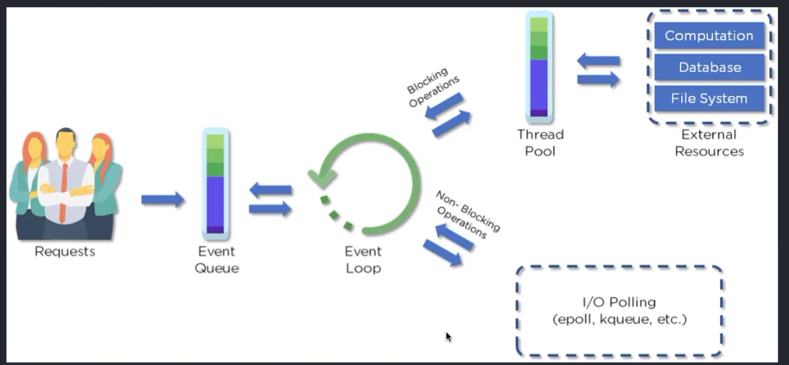

<div style="text-align: justify;">

# Nodejs

A runtime environment developed using C/C++ that contents google chrome v8 engine and used to execute javascript code outside the browser. V8 is really the fast engine to execute JS code.

[JS Conf Youtube channel](https://www.youtube.com/@jsconf_)

## Nodejs Architecture

---

JS app is always a single threaded application. It is still very fast due to asynchronous behavior.

[Article](https://www.simplilearn.com/understanding-node-js-architecture-article)



The Node.js runtime architecture follows an event-driven, non-blocking I/O model, which allows it to handle concurrent requests efficiently. Here's a high-level overview of the Node.js runtime architecture workflow:

1. Event Loop:

   - The Event Loop is the heart of the Node.js architecture. It manages and coordinates all incoming and outgoing events.
   - It constantly checks for new events or tasks in the event queue and executes them in a loop.
   - The event loop is responsible for handling I/O operations, timers, callbacks, and other asynchronous tasks.

2. Event-driven I/O:

   - Node.js utilizes non-blocking I/O operations to handle requests efficiently.
   - When a request is received, Node.js initiates the I/O operation (e.g., reading from a file, making a network request) and registers a callback function.
   - While waiting for the I/O operation to complete, Node.js moves on to handle other requests without blocking the execution of subsequent code.

3. Callbacks and Event Emitters:

   - When an I/O operation or a task completes, Node.js triggers the associated callback function or emits an event.
   - Callback functions are provided as arguments to asynchronous functions and are called once the operation is finished.
   - Event Emitters allow the creation and handling of custom events. They emit events that can be listened to by registered event listeners.

4. Event Queue:

   - The Event Queue holds events and callbacks to be processed by the Event Loop.
   - When an event or callback is triggered, it is placed in the event queue for the Event Loop to process.

5. Microtask Queue:

   - The Microtask Queue holds microtasks, which are usually promises or certain types of callbacks with higher priority than regular events.
   - Microtasks are executed before the next cycle of the event loop begins, ensuring timely execution of certain operations.

6. Timers:

   - Node.js includes a timer module that allows scheduling tasks to be executed after a specified time delay or at regular intervals.
   - Timers are managed by the Event Loop and trigger the associated callbacks when the specified time elapses.

7. Worker Threads (optional):

   - Node.js also provides a Worker Threads module that allows for the creation of additional threads to handle computationally intensive tasks in parallel.
   - Worker Threads enable multi-threaded execution, but developers need to explicitly manage the communication and synchronization between threads.

Overall, the event-driven, non-blocking I/O model, along with the event loop, allows Node.js to handle multiple requests concurrently and efficiently utilize system resources, resulting in high performance and scalability.

## Multithreading

---

We can achieve this using either child processes or clusters. It is not recommended.

For Streaming like apps, Nodejs is the best choice. For CRUD apps, you may choose any tool available.

## Node version manager

Node version manager commands

```sh
npm i -g nvm
nvm ls
```

## Global Object

```js
console.log("Hello World");

/**
 * Global Object
 *  - console
 *  - setTimeout
 *  - clearTimeout
 *  - setInterval
 *  - clearInterval
 *  - ...
 */
console.log(global);

global.setTimeout(() => {
  console.log("Hello World");
}, 1000);

/**
 * Module Object
 *  - exports
 *  - require
 *  - module
 *  - __filename
 *  - __dirname
 *  - ...
 */
console.log(module);
```

### Module


#### Builtin module

```js
const fs = require("fs");
/**
 * fs is a core module
 *  1. Core Module
 *  2. File or Folder
 *
 */
console.log(fs);
```

#### Custom Modules

`lib.js` file

```js
module.exports = {
  name: "Sajjad Ali",
  age: 23,
};
```

`index.js` file

```js
const lib = require("./lib");
console.log(JSON.stringify(lib));
```

#### Third Party Modules

First Install the module via npm:

```sh
npm install express
```

You can access it via following:

```js
const express = require("express");
```

## Home Work

- Profiler Apis
- Redux
- Reducers
- Custom Hooks

- npm package vs library

Library is not executable. However, the packages are.

## Request Methods

[Docs](https://developer.mozilla.org/en-US/docs/Web/HTTP/Methods)

- PUT
- POST
- GET
- PATCH
- PUT
- DELETE
